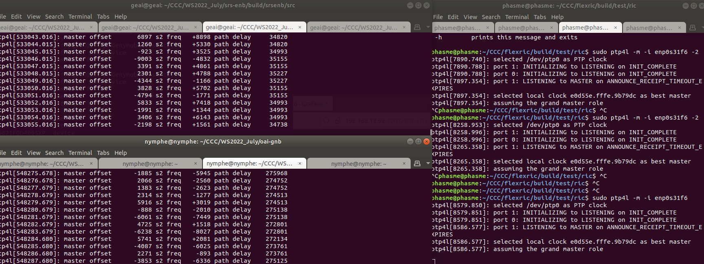
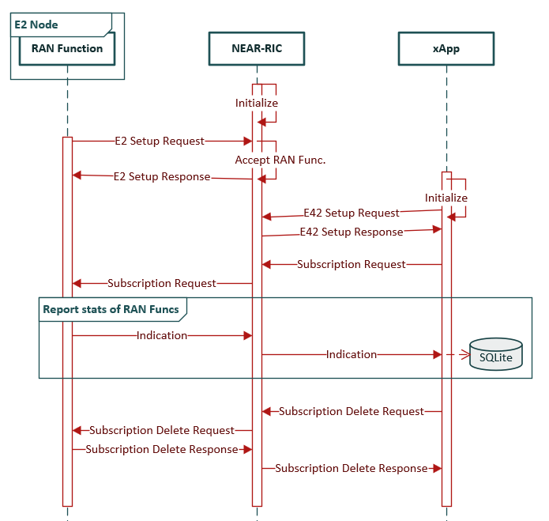
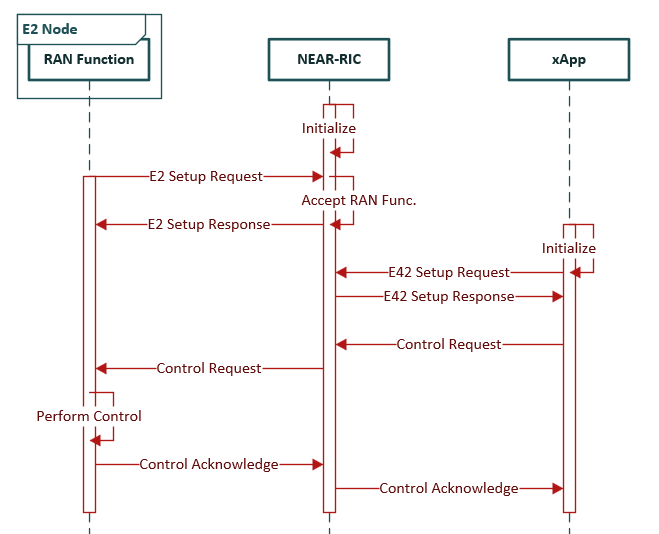

# FlexRIC

This repository contains [O-RAN Alliance](https://www.o-ran.org/) compliant E2 node Agent emulators, a NearRT-RIC, xApps written in C/C++ and Python, as well as
patches to 5G/4G OpenAirInterface and 4G srsRAN. It implements various service models (NG/GTP, PDCP, RLC, MAC, KPM v2, SLICE, TC) and a built-in emulation. Depending on the service model, different encoding schemes have been developed (ASN.1, flatbuffer, plain). The indication data received in the xApp uses as persistence mechanism an sqlite3 database for enabling offline processing applications
(e.g., ML/AI). 

If you want to know more about FlexRIC and its original architecture, you can find more details at: Robert Schmidt, Mikel Irazabal, and Navid Nikaein. 2021.
FlexRIC: an SDK for next-generation SD-RANs. In Proceedings of the 17th International Conference on emerging Networking EXperiments and Technologies (CoNEXT
'21). Association for Computing Machinery, New York, NY, USA, 411–425. DOI: https://doi.org/10.1145/3485983.3494870. A pdf copy is available at
https://bit.ly/3uOXuCV 

Below is the list of features available in this version divided per component and per service model:

|      | OAI-4g |OAI-5g| SRS-4g | E2 Agent emulator | Near RT-RIC | xApp C/C++  | xApp python | O-RAN standardized|
|:-----|:-------|:-----|:-------|:------------------|:------------|:------------------|:---------------|:--------------|
| MAC  | Y      | Y    | Y      | Y                 | Y | Y  | Y              | N |
| RLC  | Y      | Y    | Y      | Y                 | Y | Y  | Y              | N | 
| PDCP | Y      | Y    | Y      | Y                 | Y | Y  | Y              | N | 
| SLICE| Y      | N    | Y      | Y                 | Y | Y  | Y              | N |
| TC   | N      | N    | N      | Y                 | Y | Y  | N              | N |
| GTP  | N      | Y    | N      | Y                 | Y | Y  | Y              | N |
| KPM  | N      | Y    | N      | Y                 | Y | Y  | N              | Y, v.2.02 |

## 1. Installation

1.1 Install prerequisites

- A *recent* CMake (at least v3.15). 

  On Ubuntu, you might want to use [this PPA](https://apt.kitware.com/) to install an up-to-date version.

- SWIG (at least  v.4.0). 

  We use SWIG as an interface generator to enable the multi-language feature (i.e., C/C++ and Python) for the xApps. Please, check your SWIG version (i.e, `swig
  -version`) and install it from scratch if necessary as described here: https://swig.org/svn.html or via the code below: 
  
  ```bash
  git clone https://github.com/swig/swig.git
  cd swig
  ./autogen.sh
  ./configure --prefix=/usr/
  make
  make install
  ```

- Flatbuffer encoding(optional). 
  
  We also provide a flatbuffers encoding/decoding scheme as alternative to ASN.1. In case you want to use it, follow the
  instructions at https://github.com/dvidelabs/flatcc and provide the path for the lib and include when selecting it at `ccmake ..` from the build directory 

1.2 Download the required dependencies. 

Below an example of how to install it in ubuntu
```bash
sudo apt install libsctp-dev python3.8 cmake-curses-gui libpcre2-dev python3-dev
```

1.3 Clone the FlexRIC project, build and install it. 

* Download the code

  Check the [release page](https://gitlab.eurecom.fr/mosaic5g/flexric/-/releases) and read the release notes for deciding which release you want to install. You
  can download directly the code from the web or use git in the following way:

  ```bash
  # i.e.: 
  $ git clone https://gitlab.eurecom.fr/mosaic5g/flexric.git 
  # i.e. git checkout v1.0.0
  # There are rolling updates on `dev` branch that we consider unstable before releasing and tagging into master branch.
  # You can play with new features on dev branch checking it out with $git checkout dev instead of the command below
  $ git checkout <here put the release tag>
  
  ```

* Build 

  ```bash
  $ cd flexric && mkdir build && cd build && cmake .. && make 
  ```

* Install

  You can install the Service Models (SM) in your computer via:
  ```bash
  sudo make install
  ```
  By default the service model libraries will be installed in the path /usr/local/lib/flexric while the
  configuration file in /usr/local/etc/flexric. 

1.4 Test (optional step)

There are some tests you can run. Precisely:
* Service Model unit test. See directory `build/test/sm`
* 3 nodes test. See directory `build/examples/xApp/c/monitor`. This test simulates a scenario with an E2 node's, a nearRT-RIC and an xApp. Data is randomly filled. Example running in 3 terminals:
    ```bash
    # terminal 1: start E2 Node agent
    $ ./build/examples/emulator/agent/emu_agent_gnb
    # terminal 2: start nearRT-RIC
    $ ./build/examples/ric/nearRT-RIC
    # terminal 3: start monitoring app
    $ ./build/examples/xApp/c/monitor/xapp_mac_rlc_pdcp_moni
    ```
* All-in-one test. See directory `build/test/agent-ric-xapp`

Most of the tests can also be triggered by `ctest` automation framework. You would need to install ctest as further dependency if you want to use this
feature. From the build directory it is sufficent to launch `ctest` to launch the tests.

## 2. Usage/deployment

Before starting the nearRT-RIC, check that the IP address where your nearRT-RIC will be listening is the desired one at `/usr/local/etc/flexric/flexric.conf`.
Infact the default configuration assumes all the components are located in the same localhost. 

Start the nearRT-RIC with:
```bash
$ ./build/examples/ric/nearRT-RIC
```

Start one or multiple E2 node Agent emulators using default configuration
```bash
$ ./build/examples/emulator/agent/emu_agent_gnb_cu
$ ./build/examples/emulator/agent/emu_agent_gnb_du
```
or a customized one, i.e.:
```bash
$ ./build/examples/emulator/agent/emu_agent_gnb_cu -c ~/flexric1.conf &
$ ./build/examples/emulator/agent/emu_agent_gnb_du -c ~/flexric2.conf &
```
where, for example, flexric1.conf is: 
```
[NEAR-RIC]
NEAR_RIC_IP = 127.0.0.1

[XAPP]
DB_PATH = /tmp/
DB_NAME = xapp_db1
```

flexric2.conf is: 

```
[NEAR-RIC]
NEAR_RIC_IP = 127.0.0.1

[XAPP]
DB_PATH = /tmp/
DB_NAME = xapp_db2
```

Next, you can fetch some statistics from the E2 Agents using python xApps via `$ python3 build/examples/xApp/python3/xapp_gtp_moni.py`, while in other window you can start a second xApp developed in c `$ build/examples/xApp/c/monitor/xapp_mac_rlc_pdcp_moni`

You can also start wireshark and see how E2AP messages are flowing.

At this point, FlexRIC is working correctly in your computer and you have already tested the multi-agent, multi-xApp and multi-language capabilities. 

The latency that you observe in your monitor xApp is the latency from the E2 Agent to the nearRT-RIC and xApp. In modern computers the latency should be less
than 200 microsecond s or 50x faster than the O-RAN specified maximum nearRT-RIC latency of 10 ms.
Additionally, all the data received in the xApp is also written to /tmp/xapp_db in case that offline data processing is wanted (e.g., Machine Learning/Artificial Intelligence applications). Please, check the example folder for other working xApp use cases.

## 3. Integration with RAN and example of deployment

### 3.1 Integration with OpenAirInterface 4G/5G RAN

We will use a patch provided in flexric repository. Below the commands to achieve that. Substitute the pathtoflexricsrc for your use-case
```bash
$ git clone https://gitlab.eurecom.fr/oai/openairinterface5g.git oai
$ cd oai/
$ git checkout 2022.41
$ git am <pathtoflexricsrc>/flexric/multiRAT/oai/oai.patch --whitespace=nowarn
$ source oaienv
$ cd cmake_targets
$ ./build_oai -I -w USRP -i  #For OAI first time installation. it will install some dependencies
$ ./build_oai --eNB --gNB -c -C -w USRP --ninja
```

The compilation of OAI may take 10 minutes. Example configuration files using a B210 USRP are provided in flexric to facilitate the integration.

### 3.2 Integration with srsRAN 4G RAN

Install srsRAN from source following [their](https://docs.srsran.com/en/latest/general/source/1_installation.html#installation-from-source) instructions.

We will use a patch provided in the flexric repository. Below the commands to do that:
```bash
cd path/to/srsran
git checkout release_21_10
git am path/to/flexric/multiRAT/srsran/srsenb.patch --whitespace=nowarn
mkdir build && cmake .. && make -j8 
cd srsenb/src/
sudo ./srsenb
```

### 3.3 (opt) Synchronize clock

Before running the various components (RAN/flexric), you probably want to align the machines' clock. At this aim, you can use `ptp4l` in all the machines
involved (if you have for example deployed the various components on different hosts)

```bash
sudo ptp4l -m -i InterfaceName #for master
sudo ptp4l -m -i InterfaceName -s #for slaves
```


Following make sure that no ntpd, chrondy or timesyncd is running in the system (e.g., `sudo systemctl stop systemd-timesyncd`). 

```bash
sudo phc2sys -m -s InterfaceName -w
```



### 3.4 Start the processes

* Start some eNodeB/gNodeB

  Below an example with 5G or 4G OAI gNodeB/eNodeB
  ```bash
  # eNB
  $ cd oai/cmake_targets/ran_build/build
  $ sudo ./lte-softmodem -O path/to/flexric/multiRAT/oai/enb.band7.tm1.25PRB.usrpb210.replay.conf

  # gNB
  $ cd oai/cmake_targets/ran_build/build
  $ sudo ./nr-softmodem -O path/to/flexric/multiRAT/oai/gnb.sa.band78.fr1.106PRB.usrpb210.conf --sa -E --continuous-tx
  ```

* Start the nearRT-RIC

  ```bash
  $ ./build/examples/ric/nearRT-RIC
  ```

* Start different xApps

  e.g, start the monitoring xApp with `build/examples/xApp/c/monitor/xapp_mac_rlc_pdcp_moni`. The monitoring sequence diagram is represented below: 

  


  e.g, start the slicing control xApp via `$ python3 build/examples/xApp/python3/xapp_slice_moni_ctrl.py`. The controlling sequence diagram is represented below:

  

## 4. Support/further resources

* Mailing list: if you need help or have some questions, you can subscribe to the mailing list `techs@mosaic-5g.io` that you can find at
  https://gitlab.eurecom.fr/mosaic5g/mosaic5g/-/wikis/mailing-lists. The emails are archived and available publicly. 
* [Demo](DEMO.md) for flexric in July 2022
* [The Wiki space](https://gitlab.eurecom.fr/mosaic5g/flexric/-/wikis/home) contains tutorials and presentations
* [Original FlexRIC paper ACM CoNEXT 2021](https://bit.ly/3uOXuCV)

## 5. Roadmap

Check on https://gitlab.eurecom.fr/mosaic5g/flexric/-/milestones and in https://openairinterface.org/mosaic5g/
